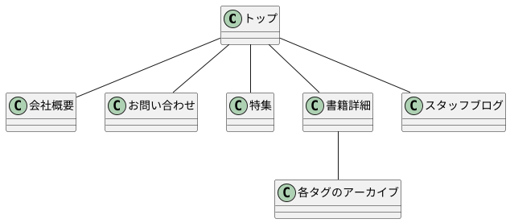

# サイト設計

## サイトの種類
コーポレートサイト（古本屋）

## サイトの目的
自社のWebサイトを通して企業イメージおよび認知度の向上を目指す

## デザイン
会社ロゴとマッチしたグレーと白を基調とした清潔感のあるデザイン

## コンテンツ
- トップページには最新情報を掲載
- 会社概要、店舗所在地
- スタッフブログでおすすめ商品・書評などを公開

## ユーザー
- 店舗に訪れるお客様（地図は見やすい場所に）

## 自社の特徴
- 他社にはない独自な切り口での特集コーナー
- ワークショップを開催している

## その他
- 真面目な姿勢と親しみやすさを伝えたい

# 設計

## 必要なコンテンツ
- トップページ（新着書籍・特集へのリンクを掲載、検索機能）
- 会社概要ページ（特に地図・営業時間を分かりやすく）
- 特集ページ（特集によってデザインに柔軟性持たせたい）
- 書籍詳細ページ（タグによるジャンル分類、アーカイブページ）
- スタッフブログ（店頭限定特集・イベント告知）
- お問い合わせページ

## サイト設計

## スラッグ
| ページ名 | スラッグ |	URL | ページの種類 |
| :--- | :--- | :--- | :--- |
| トップ |  | http://siteurl.jp/ | 固定ページ |
| 会社概要 | about | http://siteurl.jp/about/ | 固定ページ |
| 特集 | about | http://siteurl.jp/special/xxxxx/ | 固定ページ |
| 書籍詳細 | book | http://siteurl.jp/book/yymmdd/ | 投稿ページ |
| スタッフブログ | staff | http://siteurl.jp/blog/yymmdd/ | 投稿ページ |
| お問い合わせ | contact | http://siteurl.jp/contact/ | 固定ページ |

## 使用するプラグイン
| プラグイン名 | 機能 | URL |
| :--- | :--- | :--- |
| xxxxx |  |  |

## その他補足事項
